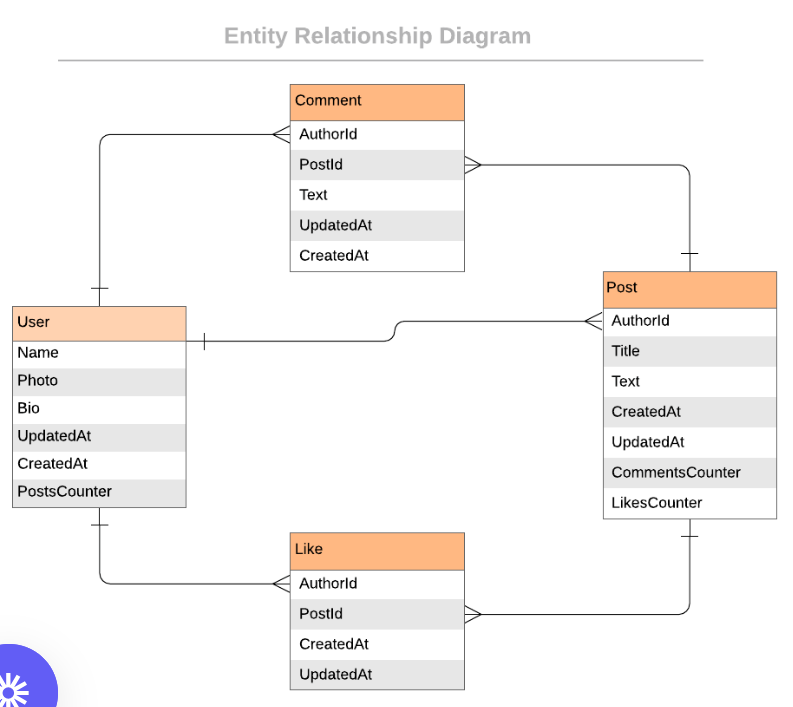

> # Blog App

| Project Veiw Screenshots|
|---------------------------------------|

|

# 📗 Table of Contents

- [📖 About the Project](#about-project)
  - [🛠 Built With](#built-with)
    - [Tech Stack](#tech-stack)
    - [Key Features](#key-features)  
- [🚀 Video Presentation ](#video-project-presentation)
- [💻 Getting Started](#getting-started)
  - [Setup](#setup)
  - [Prerequisites](#prerequisites)
  - [Install](#install)
  - [Usage](#usage)
  - [Run tests](#run-tests)
  - [Deployment](#triangular_flag_on_post-deployment)
- [👥 Authors](#authors)
- [🔭 Future Features](#future-features)
- [🤝 Contributing](#contributing)
- [⭐️ Show your support](#support)
- [🙏 Acknowledgements](#acknowledgements)
- [❓ FAQ (OPTIONAL)](#faq)
- [📝 License](#license)

# 📖 [Blog App] 

**[Blog App]** is a blog website that shows a list of posts and empowers readers to interact with them by adding comments and liking posts.

## 🛠 Built With 

### Tech Stack 
- 
Client

    <ul>
      <li><a href="https://rubyonrails.org/">Ruby on Rails</a></li>
      <li><a href="https://www.postgresql.org/">PostgreSQL</a></li>
    </ul>

### Key Features 

- Creating a data model.
- Processing data in models
- Validations and Model specs
- Routes, controllers and views
- Controllers specs
- Views
- Add forms
- Integration specs for views and fix n+1 problems
- Add devise
- Add API endpoints

(<a href="#readme-top">back to top</a>)

<!---pending->

<!-- LIVE DEMO -->

<!-- GETTING STARTED -->

## 💻 Getting Started 

To get a local copy up and running, follow these steps:

### Prerequisites

In order to run this project you need:
  - A browser of you choice.
  - A text editor of your choice.
  - Install ruby gem and depencies on your local system
  - Install Postgresql

### Setup

Clone this repository to your desired folder:

- Use the following Commands:
      https://github.com/FrankMugagga/blog_app.git
      cd blog_app    

### Usage

- rails s

### Run tests
- Run the following script and style test:
<!---To be done-->
      

(<a href="#readme-top">back to top</a>)

## 👥 Authors 

👤 **Frank Mugagga**

- GitHub: [@githubhandle](https://www.github.com/FrankMugagga)
- Twitter: [@twitterhandle](https://www.twitter.com/@mugagga_frank)
- LinkedIn: [LinkedIn](https://www.linkedin.com/in/frank-mugagga)

(<a href="#readme-top">back to top</a>)

## 🔭 Future Features 

- [ ] **[ Deploy ]**

(<a href="#readme-top">back to top</a>)

## 🤠Contributing 

Contributions, issues, and feature requests are welcome!

Feel free to check the [issues page](https://github.com/FrankMugagga/blog_app/issues).

(<a href="#readme-top">back to top</a>)

## ⭐️ Show your support 

 
  If you like this project, give it a star and share it.

(<a href="#readme-top">back to top</a>)

## 🙠Acknowledgments 

  I would like to thank Microverse.

(<a href="#readme-top">back to top</a>)

## ❓ FAQ (OPTIONAL) 

- **How to make it mobile friendly?**

  - Put a viewport tag in the header

- **How to design the site?**

  - Draw a mockup before start to code

(<a href="#readme-top">back to top</a>)

## 📠License 

This project is [MIT](https://github.com/FrankMugagga/blog_app/blob/dev/LICENSE) licensed.

(<a href="#readme-top">back to top</a>)

